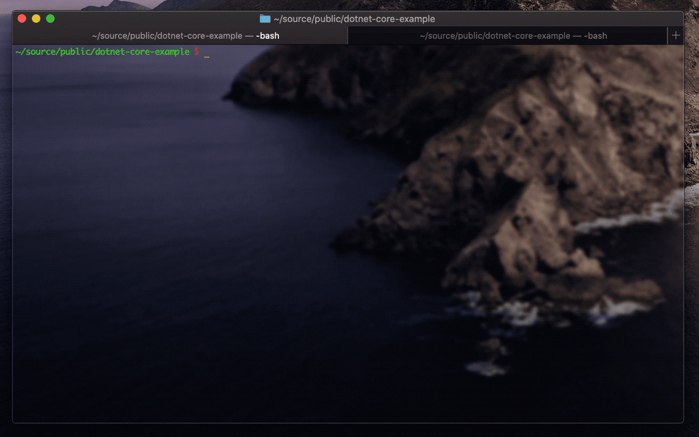

# dotnet-core-example
An example project demonstrating how to get started with .NET Core

## project setup
* If you don't have .Net Core, get it [here](https://dotnet.microsoft.com/download)
* clone this repo
* `cd` into repo folder

## trying it out
* start the server with `$ ./api-start.sh`
* add items with `$ ./api-add-item.sh "Item Name" "Some item description"`
* get items with `$ ./api-list-items.sh`

## contributions / support
Suggestions and pull requests are welcome. Thanks!